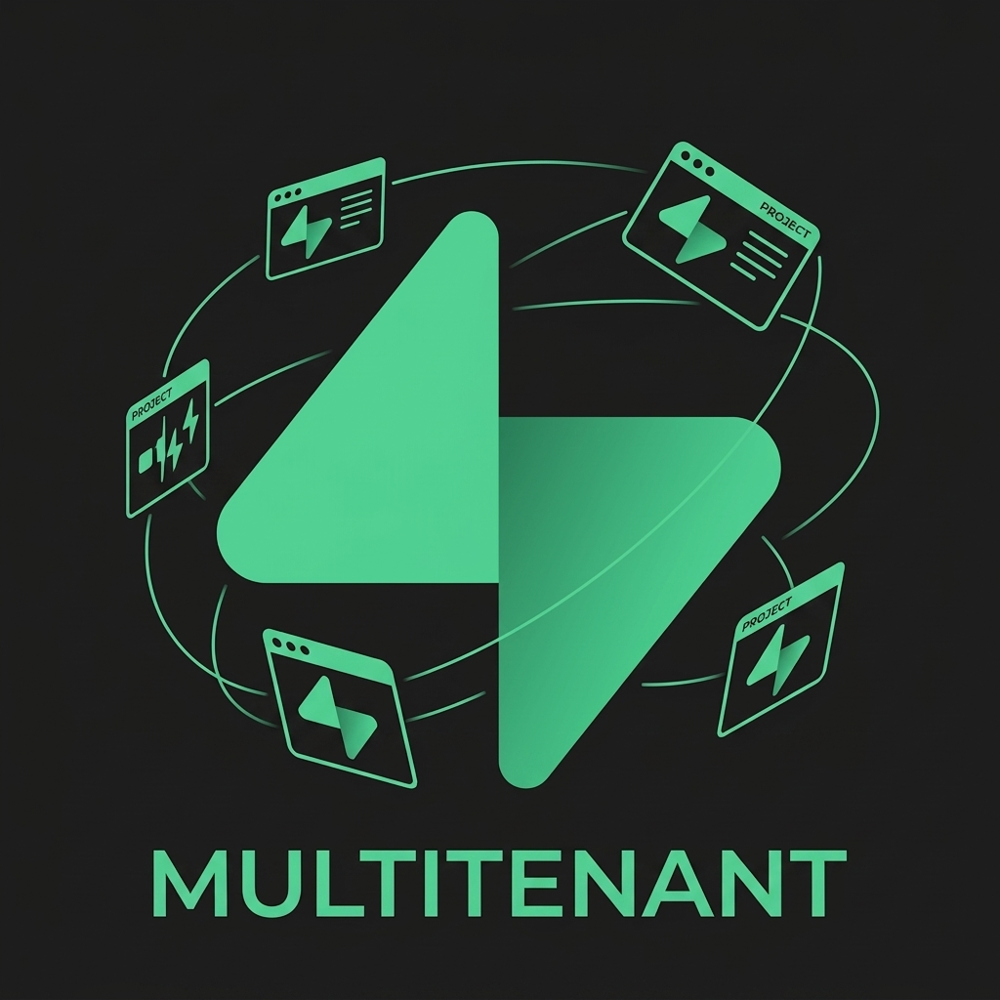
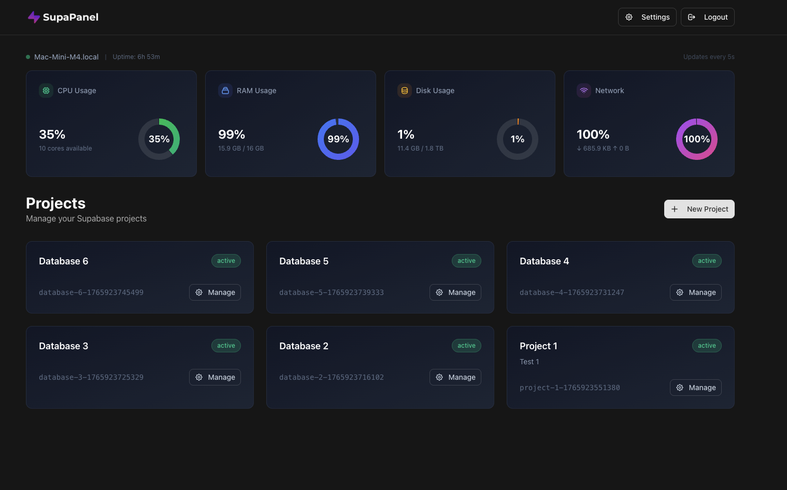
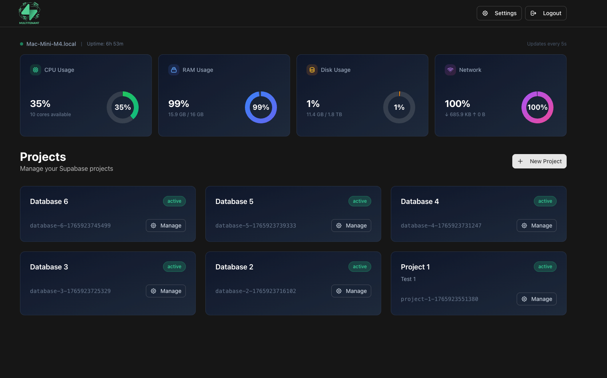

<div align="center">
  <a href="https://supabase-multitenant.github.io">
    
  </a>
  <h1>Supabase Multitenant</h1>
  <p><strong>Self-host Supabase as your own Supabase.com-style cloud — 1 infrastructure, many isolated databases.</strong></p>

  <p>
    <a href="https://supabase-multitenant.github.io">🌐 Website</a> ·
    <a href="https://github.com/supabase-multitenant/supabase-multitenant">GitHub</a> ·
    <a href="docs/SELF-HOSTING.md">Self-host</a> ·
    <a href="docs/TESTING.md">Docs</a>
  </p>

  [](LICENSE)
  [](https://hub.docker.com/r/webboxes/supabase-multitenant)
  [](https://coolify.io)
  [](https://nextjs.org)
  [](https://nodejs.org)
</div>

---

**Supabase Multitenant** is your own **Supabase.com, on your own servers**. One control plane — and every project you create spins up its own **fully isolated Supabase stack** (Postgres, Auth, API, Storage, Realtime, Studio).

The whole idea in one line: **1 infrastructure, many isolated databases.**

- 🚀 **Deploy anywhere** — a VPS, Coolify, Dokku, Dokploy, or bare metal.
- 🌐 **Real Supabase** — each project is a real, isolated Supabase stack, not a mock.
- 🔒 **You own the keys** — data stays on hardware you control. No vendor lock-in.
- ⚡ **Go live in minutes** — one command, or a couple of clicks in Coolify.

## Screenshots

<div align="center">
  
  <p><em>One dashboard to create, configure and deploy every isolated Supabase project.</em></p>
  <br />
  
  <p><em>Each project is a real, isolated Supabase stack — Auth, API (Kong), Storage, Realtime, Studio — on your own hardware.</em></p>
</div>

---

## Table of Contents

- [Screenshots](#screenshots)
- [Why Supabase Multitenant?](#why-supabase-multitenant)
- [Features](#features)
- [Deploy with Coolify (self-hosted)](#deploy-with-coolify-self-hosted)
- [Quick Start](#quick-start)
- [Tech Stack](#tech-stack)
- [Usage Guide](#usage-guide)
- [Uninstallation](#uninstallation)
- [Project Structure](#project-structure)
- [Configuration](#configuration)
- [Contributing](#contributing)
- [License](#license)

---

## Why Supabase Multitenant?

If you're looking to **self-host Supabase** without the complexity of managing Docker Compose files, Traefik configurations, and SSL certificates manually, Supabase Multitenant gives you a single platform to run many isolated Supabase databases on infrastructure you control:

- **Single-command deployment** for production environments
- **Multi-project management** from a unified dashboard — true multitenancy
- **Automatic HTTPS** via Traefik and Let's Encrypt
- **Custom domain support** for each Supabase project
- **Team collaboration** with user management

Perfect for agencies, development teams, and organizations that need to manage multiple isolated Supabase instances on their own infrastructure (VPS, Coolify, Dokku, Dokploy, or bare metal).

---

## Features

| Feature | Description |
|---------|-------------|
| **One-Command Install** | Deploy on any Linux server with a single `curl` command |
| **Docker Integration** | Automated Docker Compose deployment for each project |
| **Traefik Reverse Proxy** | Automatic HTTPS with Let's Encrypt certificates |
| **Secure Registration** | First-user-only admin registration |
| **Environment Config** | Web interface for managing project environment variables |
| **Custom Domains** | Assign unique domains to each Supabase project |
| **Team Management** | User authentication and team member access control |
| **Modern Interface** | Dark theme with responsive design using shadcn/ui |

---

## Deploy with Coolify (self-hosted)

Supabase Multitenant ships as a **one-click service** for [Coolify](https://coolify.io), so you can self-host it in a couple of clicks — no YAML editing, no manual Traefik or SSL config.

First you need a server with Docker and Coolify installed:

```bash
curl -fsSL https://cdn.coollabs.io/coolify/install.sh | bash
```

Then, from your Coolify dashboard:

1. Click **Add Service**.
2. Search for **Supabase Multitenant** → click **Deploy**.
3. Coolify provisions a Postgres instance plus the panel, injects secure credentials, assigns a domain, and serves it over **HTTPS** through Coolify's built-in Traefik proxy.
4. Open the panel URL, create your admin account, click **Initialize**, then **Create Project** to spin up your first isolated Supabase stack.

> **Not in your marketplace yet?** Deploy the same stack directly: in Coolify, add a **Docker Compose** resource and paste the compose file from [`deploy/coolify/supabase-multitenant.yml`](deploy/coolify/supabase-multitenant.yml). Coolify injects the Postgres credentials, the session secret, and the panel domain automatically.

That's the multi-tenant bit: **one control plane, and every "Create Project" runs a fully isolated Supabase database** — its own Postgres, GoTrue, Kong, Storage and Realtime — exactly like Supabase Cloud, but on hardware you own. See [`deploy/coolify/`](deploy/coolify/) for the template details.

---

## Quick Start

### Production Deployment

Deploy Supabase Multitenant on any fresh Linux server (Ubuntu 22.04+, Debian 11+):

```bash
curl -sSL https://supabase-multitenant.github.io/get | sh
```

> Alternatively, clone the repo and run `sh install.sh` as root.

The installation script will:

1. Install Docker if not present
2. Configure Traefik reverse proxy with automatic HTTPS
3. Deploy PostgreSQL database
4. Launch the Supabase Multitenant application
5. Generate secure passwords automatically

After installation, access `http://YOUR_SERVER_IP:3000` to create your admin account.

### Local Development

For local development setup, see the [Testing Guide](docs/TESTING.md).

```bash
# Clone repository
git clone https://github.com/supabase-multitenant/supabase-multitenant.git
cd supabase-multitenant

# Install dependencies
npm install

# Start PostgreSQL
docker compose -f docker-compose.dev.yml up -d

# Configure environment
cp .env.example .env
npm run db:generate
npm run db:push

# Start development server
npm run dev
```

---

## Tech Stack

| Layer | Technologies |
|-------|-------------|
| Frontend | Next.js 15, TypeScript, Tailwind CSS, shadcn/ui |
| Backend | Next.js API Routes, Prisma ORM |
| Database | PostgreSQL |
| Proxy | Traefik v3 with Let's Encrypt |
| Container | Docker, Docker Compose |

---

## Usage Guide

### Initial Setup

1. Access the panel at `http://YOUR_IP:3000`
2. Create your admin account (first user registration only)
3. Click **Initialize** to set up Supabase core files
4. Create your first Supabase project

### Creating Projects

1. Click **New Project** on the dashboard
2. Enter project name and description
3. Configure environment variables
4. Deploy with one click

### Custom Domain Configuration

To use a custom domain for your Supabase project, follow these steps:

#### Prerequisites

- A domain you own with access to DNS settings
- Your Supabase Multitenant server's public IP address

#### Step 1: Configure DNS Records

Add the following DNS records pointing to your server's IP:

| Type | Name | Value |
|------|------|-------|
| A | `api.example.com` | `YOUR_SERVER_IP` |
| A | `studio.api.example.com` | `YOUR_SERVER_IP` |

> **Note:** Replace `api.example.com` with your chosen domain and `YOUR_SERVER_IP` with your server's public IP address.

#### Step 2: Configure Domain in Supabase Multitenant

1. Go to **Dashboard** → Select your project → Click **Configure**
2. Find the **Custom Domain Configuration** section at the top
3. Enter your domain (e.g., `api.example.com`)
4. Click **Save Domain**

#### Step 3: Automatic SSL Provisioning

Once DNS is configured:
- Traefik automatically detects the domain
- Let's Encrypt issues an SSL certificate
- HTTPS is enabled automatically (no manual configuration needed)

#### Resulting URLs

After configuration, your Supabase services will be available at:

| Service | URL |
|---------|-----|
| **Supabase API** | `https://api.example.com` |
| **Supabase Studio** | `https://studio.api.example.com` |
| **PostgREST** | `https://api.example.com/rest/v1` |
| **Auth** | `https://api.example.com/auth/v1` |
| **Storage** | `https://api.example.com/storage/v1` |
| **Realtime** | `wss://api.example.com/realtime/v1` |

### Panel Domain Configuration

You can also set up a custom domain for the Supabase Multitenant dashboard itself:

1. Go to **Dashboard** → Click **Settings** (gear icon in header)
2. In the **Panel Domain** section, enter your domain (e.g., `panel.example.com`)
3. Point your domain's DNS A record to this server's IP address
4. Click **Save Domain**

After configuration:
- Access your panel at `https://panel.example.com`
- Direct IP access (`http://YOUR_IP:3000`) remains available as fallback

---

## Uninstallation

To completely remove Supabase Multitenant from your server, follow these steps:

1. **Stop and remove containers**:
   ```bash
   cd /etc/supabase-multitenant
   docker compose down -v
   ```

2. **Remove data directory** (WARNING: This will delete all your projects and data):
   ```bash
   sudo rm -rf /etc/supabase-multitenant
   ```

3. **Remove Docker image** (optional):
   ```bash
   docker rmi webboxes/supabase-multitenant:latest
   ```

---

## Project Structure

```
supabase-multitenant/
├── src/
│   ├── app/                    # Next.js App Router
│   │   ├── api/                # API routes
│   │   ├── auth/               # Authentication pages
│   │   └── dashboard/          # Dashboard pages
│   ├── components/             # React components
│   └── lib/                    # Utilities (auth, db, project, traefik)
├── prisma/                     # Database schema
├── traefik/                    # Traefik configuration
├── docs/                       # Documentation
│   └── TESTING.md              # Testing guide
├── install.sh                  # Production installation script
├── docker-compose.dev.yml      # Development PostgreSQL
└── website/                    # Marketing + docs site (Vite/React, GitHub Pages)
```

---

## Configuration

### Environment Variables

| Variable | Description | Default |
|----------|-------------|---------|
| `DATABASE_URL` | PostgreSQL connection string | Required |
| `NEXTAUTH_SECRET` | Session encryption secret | Auto-generated |
| `NEXTAUTH_URL` | Panel base URL | `http://localhost:3000` |
| `TRAEFIK_ACME_EMAIL` | Let's Encrypt notification email | `admin@example.com` |
| `DATA_PATH` | Data storage directory | `/etc/supabase-multitenant` |
| `SUPABASE_MULTITENANT_MODE` | `production` (Docker) or `development` | `development` |
| `APP_NAME` | Application display name | `Supabase Multitenant` |

---

## Contributing

Contributions are welcome. Please follow these steps:

1. Fork the repository
2. Create a feature branch: `git checkout -b feature/your-feature`
3. Make your changes
4. Commit: `git commit -m 'Add your feature'`
5. Push: `git push origin feature/your-feature`
6. Open a Pull Request

See [TESTING.md](docs/TESTING.md) for development setup instructions.

---

## License

This project is licensed under the MIT License. See the [LICENSE](LICENSE) file for details.

---

## Built With

- [Supabase](https://supabase.com) — The open-source Firebase alternative
- [Traefik](https://traefik.io) — Cloud-native reverse proxy
